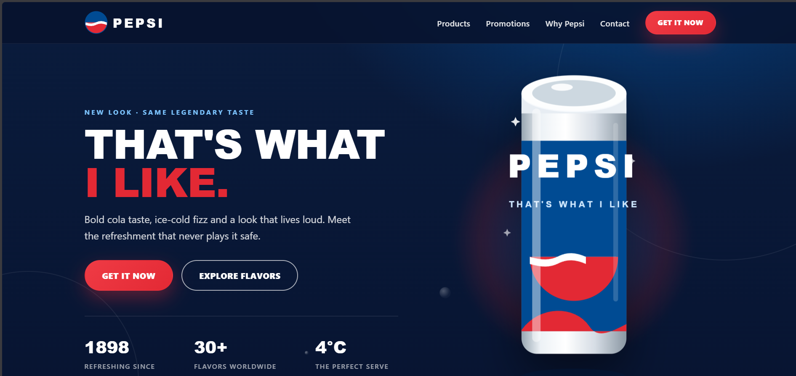

# Pepsi Concept Landing Page

A fan-made promotional landing page for Pepsi, built entirely with HTML and CSS. No JavaScript, frameworks, or external dependencies.

> **Disclaimer:** This is a fan-made concept project. Pepsi and related trademarks belong to their respective owners.

## Preview



## Overview

This single-page website showcases Pepsi's product lineup with a modern, animated design — all achieved through pure CSS.

## Tech Stack

- **HTML5**
- **CSS3**
- **SVG**

## Project Structure

```text
pepsi-website/
├── index.html
├── css/
│   └── style.css
└── images/
    ├── favicon.svg
    ├── logo.svg
    ├── hero-can.svg
    ├── can-classic.svg
    ├── can-zero.svg
    ├── can-cherry.svg
    └── can-mango.svg
